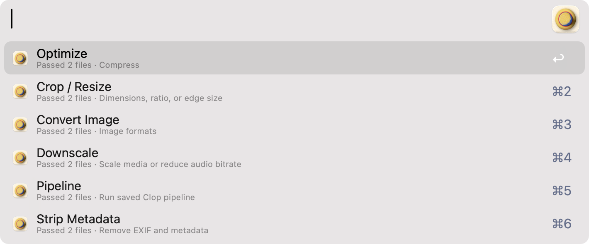
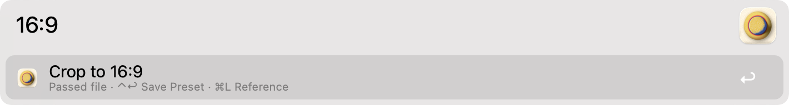
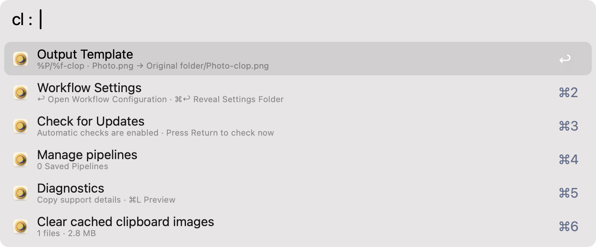

<h1 align="center">Clop for Alfred</h1>

<p align="center">
  <a href="https://lowtechguys.com/clop/">
    
  </a>
</p>

<p align="center"><strong>Optimize, resize, crop, and convert media from Alfred.</strong></p>

[Clop](https://lowtechguys.com/clop/) is a powerful, flexible macOS app that makes images, videos, PDFs, and clipboard media smaller and easier to share. It can optimize files with minimal visible quality loss, resize and crop media, convert formats, and automate those operations through its command-line tool.

Clop for Alfred is a non-official workflow puts those capabilities into a quick, searchable menu. Choose selected files, copied paths, Finder selections, URLs, clipboard images, or automation input, and the workflow shows only the actions that make sense, without asking you to remember command-line options.

<picture>
  <source media="(prefers-color-scheme: dark)" srcset="workflow/assets/readme/main-menu-dark.png">
  <source media="(prefers-color-scheme: light)" srcset="workflow/assets/readme/main-menu-light.png">
  
</picture>

## Installation

Download the `.alfredworkflow` file from the [latest release](https://github.com/ognistik/alfred-clop/releases/latest), open it, and confirm the import in Alfred.

## Requirements

- macOS 13 or newer
- Alfred with the Powerpack
- [Clop](https://lowtechguys.com/clop/) installed

## Basic use

There are multiple everyday ways to open the workflow.

1. Select files in Finder, Alfred, or another app, then run the `Clop Menu` Universal Action.
2. Copy a file, folder, URL, path, or image, then type the workflow keyword. The default keyword is `cl`.
3. Configure one of the workflow Hotkeys in Alfred.
4. Use [the external trigger](docs/external-trigger.md) for absolute control and flexibility when passing files to the workflow and creating custom automations.

Once the menu opens, type to search. Press Return to run the selected action or enter the selected parameter menu.

## Navigating the menus

The workflow is built around searchable Alfred menus.

- Type a few letters to filter actions, settings, presets, formats, devices, or sizes.
- Press Tab when Alfred shows an autocomplete suggestion.
- Press Return to choose the highlighted item.
- Press Shift to Quick Look the first input.
- Press Command-L for Large Type details. Processing menus include input paths and pixel dimensions for local images and videos.
- Use Command-Return or Shift-Return when Alfred shows those shortcuts in the subtitle.
- Delete the current query to go back to the broader menu.

Many parameter menus accept direct typing. For example, in Crop / Resize you can type a size like `16:9`, `1200x630`, or `w128`; in Downscale you can type `50%`; in Convert menus you can search for formats.

<picture>
  <source media="(prefers-color-scheme: dark)" srcset="workflow/assets/readme/crop-menu-dark.png">
  <source media="(prefers-color-scheme: light)" srcset="workflow/assets/readme/crop-menu-light.png">
  
</picture>

## Supported input

Clop for Alfred can work with:

- selected files from Alfred Universal Actions;
- Finder selections;
- copied files and folders;
- copied local paths;
- copied HTTP or HTTPS URLs;
- raw clipboard images;
- explicit files or URLs passed to the External Trigger.

Folders are inspected for supported files. Subfolders are only included when the `Recurse into folders` setting is enabled.

## Main actions

The exact list depends on the selected media. For example, image actions are hidden for audio-only input.

| Action | Use it for |
| --- | --- |
| Optimize | Compress images, videos, audio, PDFs, folders, and supported URLs. |
| Crop / Resize | Resize images and videos, crop to dimensions or aspect ratios, and optionally use Smart Crop. |
| Downscale | Scale images, videos, and audio by a percentage or factor. |
| Convert Image | Convert images to another image format. |
| Convert Video | Convert videos to another video format. |
| Convert Audio | Convert audio to another audio format. |
| Crop PDF | Crop PDFs for ratios, devices, or paper sizes. |
| Uncrop PDF | Restore cropped PDF content where Clop supports it. |
| Strip Metadata | Remove metadata from supported files. |
| Pipeline | Run saved Clop pipelines. |

In the main menu, the "Optimize" option can directly perform a quick optimization with modifiers (⌥ Standard, ⌘ Aggressive). Every action will open a parameter menu so you can choose sizes, factors, formats, PDF targets, or saved presets.

## Configuration

Type `:` in the workflow menu to open Configuration. Delete the `:` to return to the normal action menu for the same input.

<picture>
  <source media="(prefers-color-scheme: dark)" srcset="workflow/assets/readme/configuration-menu-dark.png">
  <source media="(prefers-color-scheme: light)" srcset="workflow/assets/readme/configuration-menu-light.png">
  
</picture>

This in-workflow Configuration menu is for things you may want to adjust while using Alfred:

- Output Template
- Workflow Settings
- Manage action presets
- Manage pipelines
- Check for Updates
- Diagnostics
- Clear cached clipboard images, when the workflow has cached raw clipboard images

The separate Alfred workflow configuration panel is where you set persistent workflow preferences such as notifications, Hotkeys, the settings folder, and clipboard behavior. To open it manually:

1. Open Alfred Preferences.
2. Go to Workflows.
3. Select Clop.
4. Right click and select Configure.

You can also type `:` in Clop for Alfred and choose `Workflow Settings` to open the same configuration panel. Command-Return on `Workflow Settings` reveals the active settings folder in Finder.

Choose `Diagnostics` to copy a plain-text support report for GitHub issues or debugging. Command-L previews the same report in Large Type. The report includes workflow version and configuration, Clop CLI discovery details, app version when available, preset and pipeline counts, expected command families, and discovery errors; it does not include selected files, clipboard contents, or a full environment dump.

The Alfred workflow configuration exposes these settings:

| Setting | What it controls |
| --- | --- |
| Workflow’s Keyword | The keyword used to open the workflow from Alfred. |
| Settings folder | Optional folder for `settings.json`; useful for separate configurations. |
| Read Clipboard | Whether the keyword reads the current clipboard. Explicit clipboard Hotkeys and External Trigger requests still work. |
| Clipboard History Fallback | When enabled, interactive menus can recover the newest valid input from Alfred Clipboard History if the current clipboard is not useful. |
| Preserve originals | Use the configured output template instead of replacing/rewriting in place where Clop supports output paths. |
| Default optimization | Standard or Aggressive. Command-Return can invert this for one run. |
| Floating Result | Whether Clop’s own result UI appears during processing. |
| Completion notifications | Whether successful processing and configuration updates can show notifications. |
| Error notifications | Whether failures and incomplete operations can show notifications. |
| Notify on Updates | Check GitHub weekly while the workflow is used, notify once for each new stable release, and show it at the top of the menu. |
| Copy | Whether Clop for Alfred asks Clop to copy the result. |
| Recurse into folders | Whether folder inspection and execution include subfolders. |
| Clipboard image retention | How long workflow-owned raw clipboard image files are kept. |

Notifications use Alfred’s native notification object and are titled `Clop`.

## Updates

With `Notify on Updates` enabled, Clop for Alfred checks for a newer stable GitHub
release at most once every seven days when you use the workflow. There is no
background service. When an update is available, Alfred notifies once and keeps
an actionable update item at the top of the main menu. Press Return on that item
to open the release page.

To check immediately, type `:` and choose `Check for Updates`. Automatic check
failures stay quiet so temporary network problems do not interrupt normal use.

## Output templates

When `Preserve originals` is enabled (or you select this option while holding shift) Clop for Alfred uses the configured output template. The built-in template is:

```text
%P/%f-clop
```

Supported tokens:

| Token | Meaning |
| --- | --- |
| `%P` | Source folder |
| `%f` | Filename without extension |
| `%y` | Year |
| `%m` | Month number |
| `%n` | Month name |
| `%d` | Day |
| `%w` | Weekday |
| `%H` | Hour |
| `%M` | Minute |
| `%S` | Second |
| `%p` | AM or PM |
| `%r` | Random characters |
| `%i` | Incrementing number |

Clop adds the output extension automatically.

Examples:

```text
%P/%f-clop
~/Desktop/Clop/%f
%P/Processed/%y-%m-%d-%f
```

## Presets and pipelines

Parameter menus can save reusable presets. Use the Configuration menu to review or remove saved presets.

Pipelines are saved Clop pipeline recipes. Use `:pipelines` in Configuration to browse, add, replace, or remove them. The workflow also includes an “AI pipeline prompt” helper that copies a local reference prompt for an AI assistant; it does not send anything to AI itself.

## External Trigger automation

Advanced users can drive the workflow from Alfred’s External Trigger:

```text
workflow: com.aft.clop
trigger: clop
```

The trigger supports menu opening, direct execution, explicit files and URLs, Finder input, clipboard input, and typed JSON requests.

See [External Trigger reference](docs/external-trigger.md) for the exact syntax and examples.

## Troubleshooting

- If no actions appear, check that the selected or copied input is a supported file, folder, URL, or image.
- If folder contents are missing, enable `Recurse into folders` if you need subfolders.
- If the keyword should not read the clipboard, turn off `Read Clipboard`.
- If the keyword has no current clipboard input but you want Alfred Clipboard History recovery, enable `Clipboard History Fallback`.
- If Clop cannot be found, make sure the Clop app is installed and has not been moved to an unusual location.
- If you need help with a bug, type `:` and choose `Diagnostics`, then paste the copied report into your GitHub issue.
- If workflow objects were changed while developing locally, restart Alfred so it reloads the workflow canvas.

## Developer documentation

- [Architecture](docs/architecture.md)
- [External Trigger reference](docs/external-trigger.md)
- [Clop CLI reference](docs/clop-cli-reference.md)
- [Release process](docs/release.md)

## Support the workflow

Clop for Alfred is an independent, unofficial Alfred workflow for running [Clop](https://lowtechguys.com/clop/). If it makes your day a little easier, you can support its development through [Buy Me a Coffee](https://buymeacoffee.com/afadingthought) or [PayPal](https://paypal.me/obergfilms).
